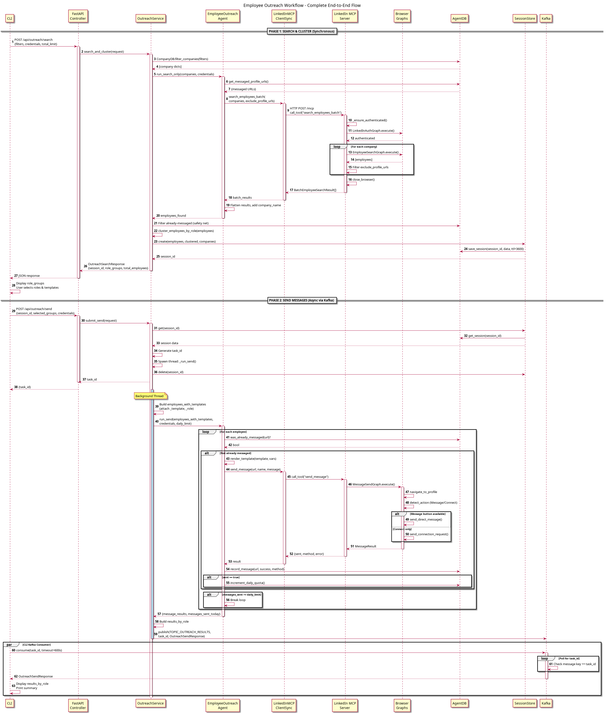

# Serial LinkedIn Killer

Agent system for automating LinkedIn job applications and employee outreach. Three-layer architecture: CLI → Core Agent API (FastAPI + Kafka) → LinkedIn MCP Server (Selenium).

<p align="center">
  
</p>

## Architecture

```
CLI (local)
  ├── HTTP POST → Core Agent API (Docker) → returns task_id
  │                  ├── JobApplicationAgent (LangGraph)
  │                  └── EmployeeOutreachAgent (LangGraph)
  │                        ↓
  │                  MCP Client → LinkedIn MCP Server (HTTP)
  │                        ↓                ↓
  │                  Shared DB ←── MCP writes SearchResult rows per-company
  │                        ↓
  │                  Kafka ← MCP publishes MCPSearchComplete
  │                        ↓
  │                  Core Agent reads results from DB
  │                        ↓
  │                  Kafka Producer → [outreach-search-results / outreach-results]
  │                        ↓
  └── Kafka Consumer ← CLI receives results
```

**Services (docker-compose):**
- `kafka` — KRaft mode, message broker
- `core-agent` — FastAPI API on port 8080, orchestrates workflows
- `linkedin-mcp-server` — FastMCP server on port 3000, browser automation
- `shared DB` — SQLite, used by both core-agent and MCP for search results

## Quick Start

Download the dataset from [dataset-url](https://www.peopledatalabs.com/data-lab/dataset/company-dataset) and add the CSV to 'data/free_company_dataset.csv'

```bash
# Install
poetry install

# Set credentials
export LINKEDIN_EMAIL="your-email"
export LINKEDIN_PASSWORD="your-password"

# Import company dataset into SQLite (one-time, for outreach)
poetry run python scripts/cli.py import-dataset

# Start services
docker compose up -d

# Run CLI
poetry run python scripts/cli.py --help
```

## Outreach Workflow (Two-Phase)

The outreach workflow uses role-based clustering to target employees by job function, with optional B2C/B2B segment filtering:

```
Phase 1: Search & Cluster (async via Kafka)
  ├── Filter companies by industry/country/size
  ├── Optionally limit number of companies (--company-limit)
  ├── Search employees at each company via LinkedIn MCP
  │     └── MCP writes results to shared DB, publishes completion to Kafka
  ├── Cluster employees by role using LLM classification
  ├── Optionally filter by B2C or B2B segment
  └── Results delivered via Kafka topic: outreach-search-results
        ↓
  Role Groups:
    B2C: Engineering, Finance, Investment Banking / M&A, Strategy Consulting, Crypto / Web3
    B2B: Broker_Exchange_HeadOfProduct, WealthManager_PortfolioManager,
         Fintech_ProductManager, FamilyOffice_CIO, Insurance_HeadOfProduct,
         Corporate_Treasurer_CFO, Boutique_FundManager
    General: Sales, Marketing, HR/People, Operations, Executive, Other
        ↓
Phase 2: Message (async via Kafka)
  ├── User selects which role groups to message
  ├── User provides different templates per role group
  └── Agent sends messages with per-group personalization
```

**Interactive CLI flow:**
```bash
poetry run python scripts/cli.py outreach --interactive

# 1. Select company filters (industry, country, size)
# 2. Set total employee limit and company limit (optional)
# 3. Choose B2C/B2B/both segment
# 4. API searches employees and clusters by role
# 5. See role groups with employee counts
# 6. Select which groups to message
# 7. Enter message template for each group
# 8. Preview and confirm
# 9. Messages sent, results displayed by role
```

## CLI Commands

```bash
# Job application workflow
poetry run python scripts/cli.py run

# Employee outreach (interactive, two-phase)
poetry run python scripts/cli.py outreach --interactive

# Outreach with total employee limit
poetry run python scripts/cli.py outreach --interactive --total-limit 100

# Outreach with config (non-interactive)
poetry run python scripts/cli.py outreach --no-interactive

# Warm-up mode (cap at 10 messages)
poetry run python scripts/cli.py outreach --warmup

# Import company CSV into SQLite
poetry run python scripts/cli.py import-dataset

# Test API connection
poetry run python scripts/cli.py test-connection

# Init/validate config
poetry run python scripts/cli.py init
poetry run python scripts/cli.py validate
```

## API Endpoints

| Method | Path | Description |
|--------|------|-------------|
| `GET` | `/health` | Health check |
| `POST` | `/api/jobs/apply` | Submit job application workflow |
| `GET` | `/api/outreach/filters` | Get filter values (industry, country, size) |
| `POST` | `/api/outreach/search` | Phase 1: Search & cluster (async, returns task_id, results via Kafka) |
| `POST` | `/api/outreach/send` | Phase 2: Send messages to selected groups (async, results via Kafka) |
| `POST` | `/api/outreach/run` | Legacy: Single-phase outreach (async) |

**Phase 1 - Search & Cluster:**
```bash
curl -X POST http://localhost:8080/api/outreach/search \
  -H "Content-Type: application/json" \
  -d '{
    "filters": {"industry": ["Technology"], "country": ["United States"]},
    "credentials": {"email": "...", "password": "..."},
    "total_limit": 100,
    "company_limit": 50,
    "segment": "b2b"
  }'

# Response: { "task_id": "uuid" }
# Results delivered via Kafka topic: outreach-search-results
```

**Phase 2 - Send Messages:**
```bash
curl -X POST http://localhost:8080/api/outreach/send \
  -H "Content-Type: application/json" \
  -d '{
    "session_id": "uuid-from-phase-1",
    "selected_groups": {
      "Engineering": {
        "enabled": true,
        "message_template": "Hi {employee_name}, I saw you work at {company_name}...",
        "template_variables": {"my_name": "John", "my_role": "Recruiter"}
      },
      "Sales": {
        "enabled": true,
        "message_template": "Hello {employee_name}, I have an opportunity...",
        "template_variables": {"my_name": "John"}
      }
    },
    "credentials": {"email": "...", "password": "..."},
    "warm_up": false
  }'

# Response: { "task_id": "uuid" }
# Results delivered via Kafka topic: outreach-results
```

## Kafka Topics

| Topic | Direction | Description |
|-------|-----------|-------------|
| `job-results` | Core → CLI | Job application workflow results |
| `outreach-search-results` | Core → CLI | Phase 1 search & cluster results |
| `outreach-results` | Core → CLI | Phase 2 message sending results |
| `mcp-search-complete` | MCP → Core | MCP signals batch search completion |

## Configuration

All config lives in `config/agent.yaml`:

```yaml
llm:
  base_url: "http://localhost:8088/v1"
  api_key: "not-needed"
  temperature: 0.1

mcp_server:
  host: "localhost"
  port: 8000

outreach:
  dataset_path: "./data/free_company_dataset.csv"
  db_path: "./data/companies.db"
  employees_per_company: 10
  daily_message_limit: 50
  delay_between_messages_min: 30.0
  delay_between_messages_max: 120.0

db:
  url: "sqlite:///./data/agent.db"  # SQLAlchemy URL — auto-created on first run
  company_url: "sqlite:///./data/companies.db"

kafka:
  bootstrap_servers: "localhost:9092"

api:
  host: "0.0.0.0"
  port: 8080
```

Environment variables override config: `LINKEDIN_EMAIL`, `LINKEDIN_PASSWORD`, `KAFKA_BOOTSTRAP_SERVERS`, `LOCAL_LLM_BASE_URL`, `MCP_SERVER_HOST`, `MCP_SERVER_PORT`.

## CV Data

Structured JSON at `data/cv_data.json`:

```json
{
  "name": "string",
  "work_experience": [
    { "title": "string", "company": "string", "start_date": "MM-YYYY", "end_date": "MM-YYYY", "stack": ["string"] }
  ],
  "education": [{ "title": "string", "institution": "string" }],
  "skills": [{ "title": "string", "level": "Advanced|Intermediate|Basic" }],
  "languages": [{ "title": "string", "level": "Native|Fluent|Intermediate|Basic" }]
}
```

## Company Dataset

CSV at `data/free_company_dataset.csv`, imported into SQLite via `import-dataset` command.

| Column | Example |
|--------|---------|
| `name` | `acme corp` |
| `industry` | `software` |
| `country` | `united states` |
| `size` | `51-200` |
| `linkedin_url` | `linkedin.com/company/acme` |
| `locality` | `san francisco` |

## Role Categories

The LLM clusters employee job titles into these categories:

| Segment | Category | Example Titles |
|---------|----------|----------------|
| B2C | Engineering | Software Engineer, DevOps, Architect, QA |
| B2C | Finance | CFO, Financial Analyst, Controller, Accountant |
| B2C | Investment Banking / M&A | Managing Director, VP of M&A, Deal Analyst |
| B2C | Strategy Consulting | Strategy Consultant, Management Consultant |
| B2C | Crypto / Web3 | Blockchain Developer, DeFi Analyst |
| B2B | Broker_Exchange_HeadOfProduct | Head of Product at broker/exchange |
| B2B | WealthManager_PortfolioManager | Portfolio Manager, Wealth Advisor |
| B2B | Fintech_ProductManager | Product Manager at fintech |
| B2B | FamilyOffice_CIO | CIO at family office |
| B2B | Insurance_HeadOfProduct | Head of Product at insurance firm |
| B2B | Corporate_Treasurer_CFO | Corporate Treasurer, CFO |
| B2B | Boutique_FundManager | Fund Manager at boutique firm |
| General | Sales | Sales Rep, Account Executive, SDR, Business Dev |
| General | Marketing | Marketing Manager, Content, Growth, Brand |
| General | HR/People | Recruiter, Talent Acquisition, People Ops |
| General | Operations | Project Manager, Program Manager, Supply Chain |
| General | Executive | CEO, CTO, VP, Director, Head of |
| General | Other | Unclassified titles |

## Development

```bash
poetry install
poetry run pytest tests/
```

## Sequence Diagrams

Detailed PlantUML sequence diagrams documenting the outreach workflow:

### Full Workflow


For more diagrams, see the `docs/diagrams` directory.

## License

Apache License 2.0. See [LICENSE](LICENSE) for details.

**Disclaimer:** This software is provided for educational and research purposes. Users are responsible for ensuring compliance with LinkedIn's Terms of Service.
